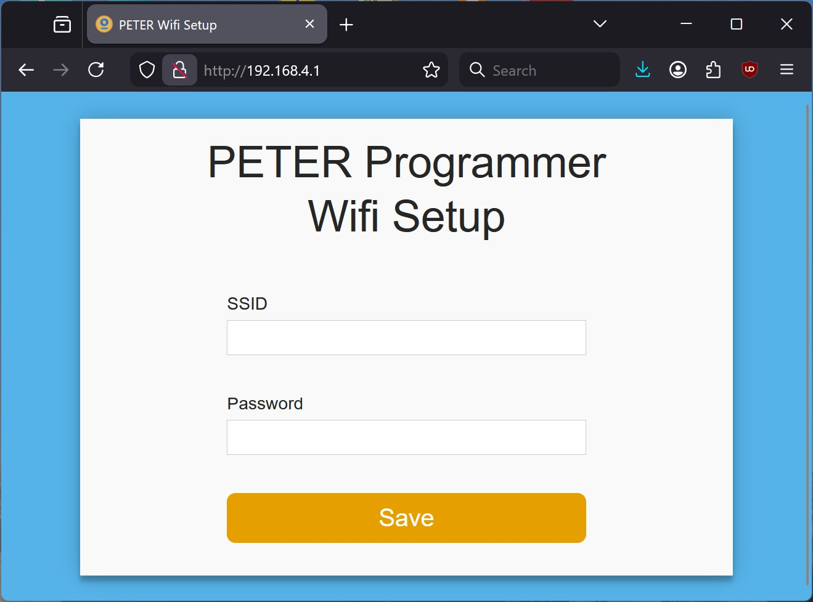
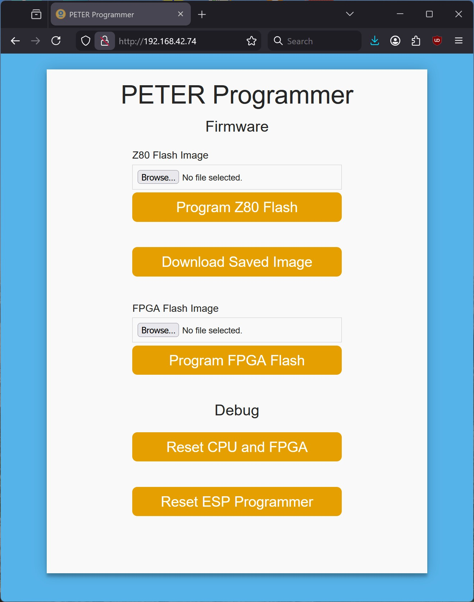
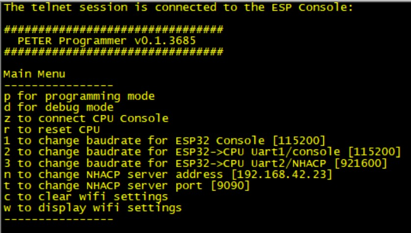
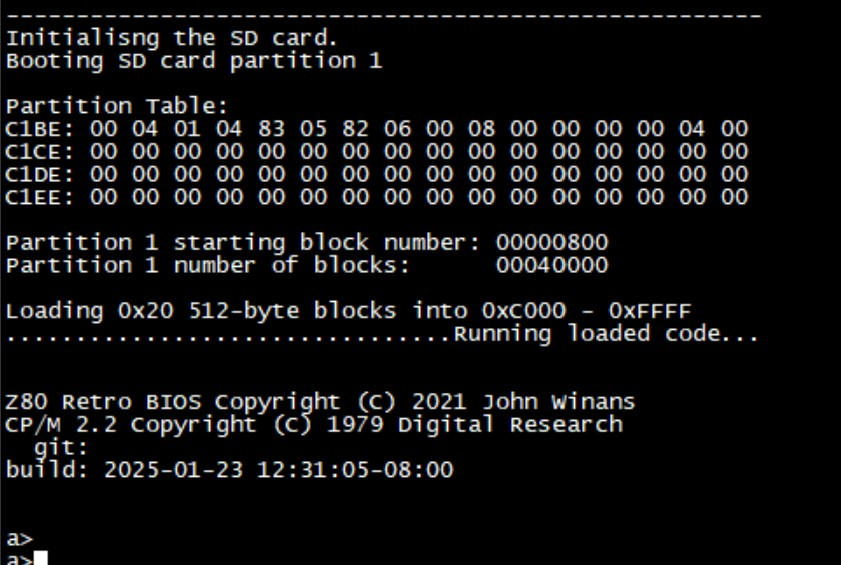

# PETER-Programmer
The PETER-Programmer is a WiFi interface for the Retro CPU and it can program files to FPGA Flash - CPU boot code and FPGA images, as well as program an eZ80F91 Flash over ZDI. It's also rather useful at providing a CPU reset or a system reset remotely.

## Information:
Refer to the [schematic](https://github.com/dennowiggle/Retro-PETER/blob/main/Hardware/PETER/output/PETER_V0.0_BW.pdf) for connections.

## WiFi Setup
* On first boot the module enters WiFi host AP mode.
  - Connect local computer to WiFi network SSID `PETER-programmer` with password `Z80-Nouveau!`
  - If the local computer is set for DHCP it should be assigned an address on the PETER-Programmer network 192.168.4.x If not manually configure local computer IP address to 192.168.4.2
  - Z80-Retro! WiFi setup IP address is 192.168.4.1
  - Open a webpage at address http://192.168.4.1 to set the WiFi parameters for WiFi client mode in the local network environment. 
  - NOTE: Often a browser may change to https:// and in that case it needs changed back to http://

* Power cycle after setting the SSID network you want to use.
  

* If having problems setting up WiFi the PETER-Programmer boot-up log can be seen by connecting a physical TTL level serial cable at 115200 on pins.
  - Once you see the menu:
    - W shows WiFi address.
	- C clears WiFi settings to start the sequence again.

## Web Page Use
* On the local WiFi router find the new IP address that the DHCP server assigned.
* Alternatively connect a serial cable to PETER Programmer as described below and type W to see the WiFi address assigned.
* Connect local computer to local WiFi network.
* Open webage and enter the IP address assigned by DHCP server to the PETER-Programmer! 

## Remote Wireless Console - to PETER-Programmer!
* There is Telnet console access to PETER-Programmer at the same IP address on port 2323.
  - The jumper pins aBOVE need to be connected for WiFi mode.

## Remote Wireless Console - to CPU Console Port
* There is Telnet console access to the CPU at the same IP address on port 23.
* Use remote WiFi CPU console access by using PETER-Programmer console to match the baud rate of the ESP32 to the CPU.

## Flashing an ESP32 binary on PETER-Programmer
* To program the ESP32 on the PETER board use the USB JTAG port J1202.

* Using the [Web](https://dennowiggle.github.io/PETER-Programmer/)
  - Select the file.
  - Connect and then upload.
  - Select logs and the click to reset the board.
  - Requires Microsoft Edge or Google Chrome/Chromium.

* Using Windows
  - Run the flash.bat script that is in the release directory.
  - e.g. `flash.bat COM3 115200`

* Using Linux/python
  - Install the programmer `pip install esptool`.
  - Run the flash.sh script that is in the release directory.
  - e.g. `sh flash.sh /dev/ttyACM0 115200`

## Physical Serial Connection to PETER-Programmer Console
* Connect a TTL level serial cable to
  - J1105.11 RX (ESP32 Tx)
  - J1105.12 TX (ESP32 Rx)
  - J1105.13 GND

## Connecting FPGA UARTs to WiFi
* UART1 Console
  - Connect Jumper J1004 pin 2 to 4, and pin 1 to 3.
* UART2 NHACP
  - Connect Jumper J1001 pin 2 to 4, and pin 1 to 3.

## Connecting FPGA UARTs to USB
* UART1
  - Connect Jumper J1004 pin 4 to 6, and pin 3 to 5.
  - Connect USB-C cable to J1002
* UART2
  - Connect Jumper J1001 pin 4 to 6, and pin 3 to 5.
  - Connect USB-C cable to J1005

## Alternate : Connecting up Retro CPU console signals (UART1)
* To use USB interface for UART1
  - Connect CPU UART1 Tx to J1004.6
  - Connect CPU UART1 Rx to J1004.5
  - Connect USB-C cable to J1002
* To use WiFi interface for UART1 Console
  - Connect CPU UART1 Tx to J1004.2
  - Connect CPU UART1 Rx to J1004.1
  - Connect USB-C cable to J1002

## Connecting up Retro CPU NHACP signals (UART2)
* To use USB serial interface for UART2
  - Connect CPU UART2 Tx to J1001.6
  - Connect CPU UART2 Rx to J1001.5
* To use WiFi interface for UART2 NHACP
  - Connect CPU UART2 Tx to J1001.2
  - Connect CPU UART2 Rx to J1001.1

